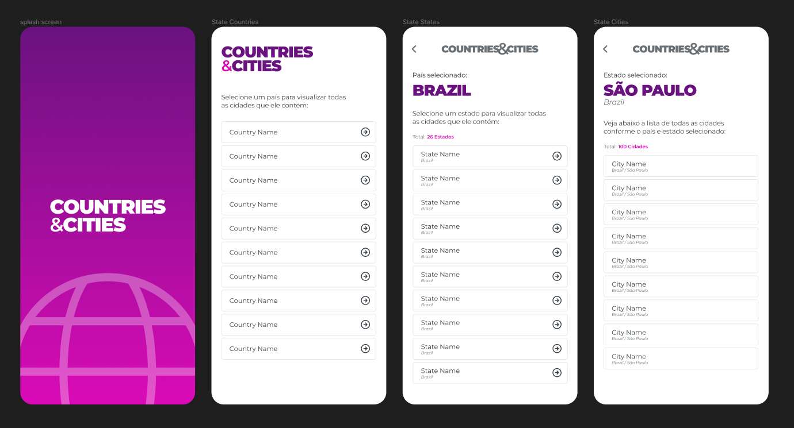

# COUNTRIES & CITIES

Projeto básico de uma aplicação mobile feito em Flutter, com objetivo de abordar algumas funcionalidades ao consumir uma Rest API.

> ## Pontos importântes

O projeto mobile foi construído seguindo alguns padrões de mercado.  
São eles:

- Projeto criado em uma das versões recentes mais estáveis lançada até o momento
- Segue o conceito de CLEAN ARCHITECTURE e todas as camadas de abstrações
    - Domain, Data e Presenter
- Princípios do SOLID
    - Injeção de dependencias
    - Uma única responsabilidade para as classes
- Geriamento de estado utilizando BLOC/CUBIT
- Navegação por rotas globais e nomeadas
- Arquivo de Themas para personalização de fontes, cores, tamanhos e etc.
- Criação de widget que são reaproveitados dentro do projeto
- Consumo de dados via REST API

> ## Layout
A idéia do projeto é exibir em fases a listagem de países, estados e cidades.  
O projeto foi prototipado no Figma, conforme o print das telas abaixo:

[Clique aqui para visualizar o protótipo diretamente no figma](https://www.figma.com/proto/4GKTDFOP5hYpc0zdsPUIZT/Countries-%26-Cities?page-id=0%3A1&node-id=3%3A296&viewport=-152%2C478%2C0.71&scaling=min-zoom)




> ## Firebase, NodeJs e CSV
Com base em uma lista de países, estados e cidades em um arquivo excel (csv), uma conta no firebase foi criada para guardar em banco de dados não relacional as informações contidadas no arquivo excel. Um projeto em node foi criado com a responsabilidade de fazer a leitura dos registro no arquivo excel e adicionar no firebase.

Este projeto em Node está em uma pasta chamada **node_excel_to_firebase**, e está localizado na raiz deste git. Para rodar esse projeto basta executar os comando abaixo no terminal:

```
node index.js
```

**ATENÇÃO**  
Mas, por algum bloqueio de conta free no firebase a importação do arquivo excel não foi bem sucedida, pois acaba chegando no limite diário de requisições para contas free.

Para solucionar e ter disponível toda a lista de paises, foi utilizado o **Json-Server**, que simula um serviço REST para aplicações.

> ## Json-Server

### INSTALANDO O JSON-SERVER
Para realizar a instalação do Json-Server basta abrir o terminal e executar o comando abaixo:
```
npm install -g json-server
```

A documentação do Json-Server pode ser encontrada no link: https://www.npmjs.com/package/json-server

### RODANDO A API COM JSON-SERVER
Abra um novo terminal e entre na pasta **json-server** que está na raiz deste repositório git.  
Dentro da pasta, execute o comando abaixo:

```
json-server --watch db.json
```

Com isso a api está pronta para ser lida dentro da aplicação mobile.

> ## Projeto Mobile

### FLUTTER E DART - VERSÕES
Flutter 2.10.4 • channel stable • https://github.com/flutter/flutter.git  
Framework • revision c860cba910 (4 months ago) • 2022-03-25 00:23:12 -0500  
Engine • revision 57d3bac3dd  
Tools • Dart 2.16.2 • DevTools 2.9.2

### RODANDO O PROJETO MOBILE
Antes de rodar o projeto, devemos baixar os pacotes essenciais para o projeto.  
Então, no terminal, rode os comandos abaixo:

```
flutter pub get
flutter pub upgrade
```

Pronto, feito isso, agora é rodar o projeto mobile.  
Ainda no terminal, execute o comando abaixo:

```
flutter run
```